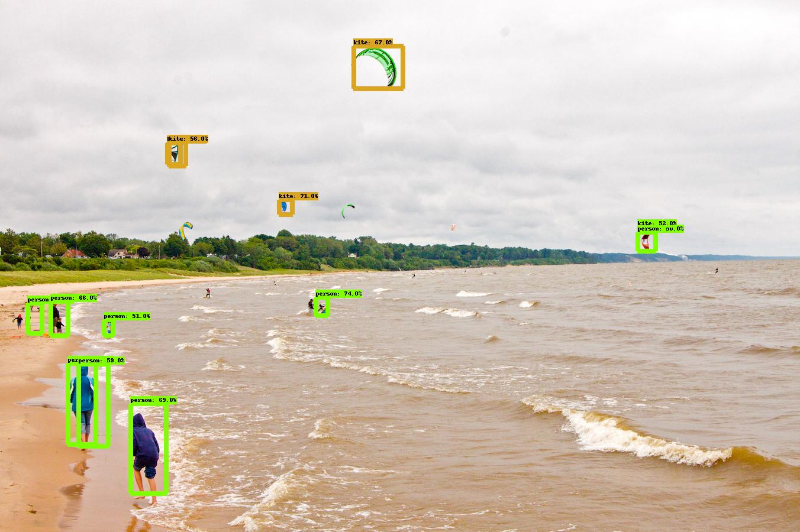

# tfhub-od-easy
[](LICENSE)
[](https://www.python.org/downloads/release/python-360/)

[TensorFlow Hub](https://tfhub.dev/) lets you search and discover hundreds of trained, ready-to-deploy machine learning models in one place. 
This repo offers a minimal codebase to deploy **TF2 Image Object Detection** models from TensorFlow Hub for image object detection, 
video object detection, webcam object detection, and evaluation on the MS COCO 2017 validation dataset (5000 images). Simply replace the *--url* argument 
in any of the demos below with the url of the model of interest from https://tfhub.dev/s?module-type=image-object-detection&tf-version=tf2.  
  
Example urls:
* https://tfhub.dev/tensorflow/ssd_mobilenet_v2/2
* https://tfhub.dev/tensorflow/centernet/hourglass_512x512_kpts/1
* https://tfhub.dev/tensorflow/efficientdet/d3/1
* etc.

## Demos

Before attempting the commands below make sure that your system meets the requirements listed in https://www.tensorflow.org/install. Namely that Python version is between 3.5 - 3.8.
```
pip install --upgrade pip
pip install -r requirements.txt
```

### Detect Image
``` bash
# detect image with SSD Mobilenet v2 
python detect_image.py --url https://tfhub.dev/tensorflow/ssd_mobilenet_v2/2 --image_input ./data/kite.jpg

# detect image with EfficientDet-d7
python detect_image.py --url https://tfhub.dev/tensorflow/efficientdet/d7/1 --image_input ./data/kite.jpg
```
#### Output

##### SSD Mobilenet v2
<p align="center"></p>

### Detect Video
``` bash
# detect video with SSD Mobilenet v2 
python detect_video.py --url https://tfhub.dev/tensorflow/ssd_mobilenet_v2/2 --video ./data/video.mp4 --output ./detect-test.mp4
```

### Detect Webcam
``` bash
# detect webcam with SSD Mobilenet v2 
python detect_video.py --url https://tfhub.dev/tensorflow/ssd_mobilenet_v2/2 --video 0
```
### Evaluate on MS COCO 2017 Validation Dataset
```bash
./scripts/get_coco_dataset_2017.sh
python evaluate.py --url https://tfhub.dev/tensorflow/ssd_mobilenet_v2/2
cd mAP/extra
python remove_space.py # enter 'y' for everything
cd ..
python main.py # expect mAP of 29.70% for https://tfhub.dev/tensorflow/ssd_mobilenet_v2/2
```
### Save Model
``` bash
# save SSD Mobilenet v2 to saved_models
python save_model.py --url https://tfhub.dev/tensorflow/ssd_mobilenet_v2/2
```
Note:
* This specific model (SSD Mobilenet v2) has already been saved to the repo by default.
* These models are not fine-tunable. If you want to save fine-tunable models, you can do so manually from https://github.com/tensorflow/models/blob/master/research/object_detection/g3doc/tf2_detection_zoo.md
### Detect Image From Saved Model
``` bash
python detect_image.py --url ./saved_models/ssd_mobilenet_v2_2
```

## TODO
* [ ] TensorFlow Lite Support
* [ ] Training/Fine-tuning support

## Acknowledgements
This project was inspired by
* [Yolov4 tf2](https://github.com/hunglc007/tensorflow-yolov4-tflite)
* [Yolov4 tf2 with webcam detection](https://github.com/theAIGuysCode/tensorflow-yolov4-tflite)
* [Object Detection API Demo](https://github.com/tensorflow/models/blob/master/research/object_detection/colab_tutorials/object_detection_tutorial.ipynb)
* [TensorFlow 2 Object Detection API tutorial](https://tensorflow-object-detection-api-tutorial.readthedocs.io/en/latest/index.html)
